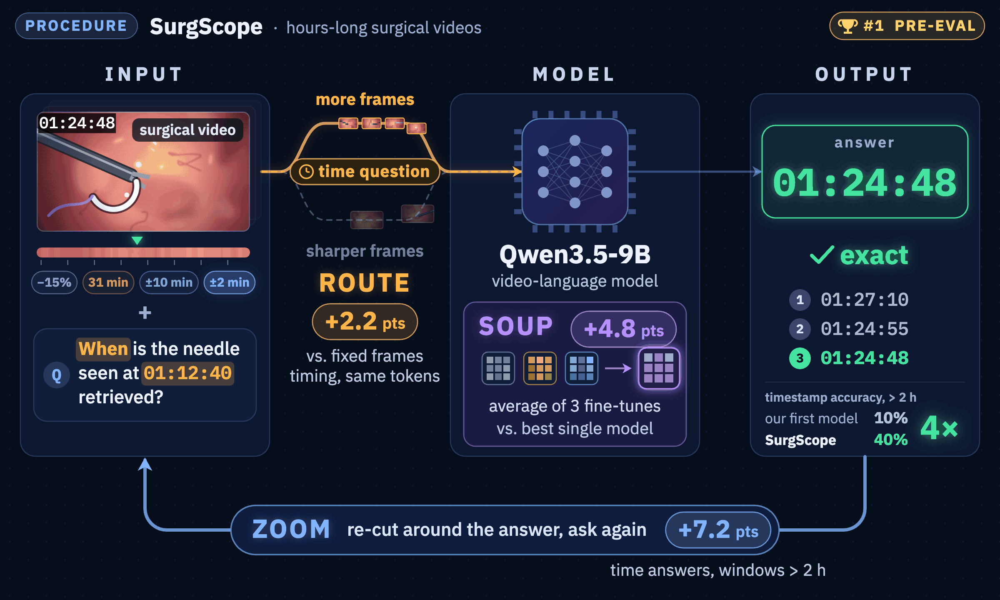

<div align="center">

# 🔭 SurgScope

### Question-Conditioned Windowing for Hour-Long Surgical Video Question Answering

**Our solution to the PROCEDURE track of the [ORena SAVE FOCUS Challenge](https://orena-focus-challenge.org/), MICCAI 2026**

[](https://huggingface.co/wxyi088/orena-SurgScope)
[](https://huggingface.co/datasets/orena-dkfz/heico-focus-vqa)
[](https://huggingface.co/datasets/orena-dkfz/lapchole-focus-vqa)
[](https://huggingface.co/Qwen/Qwen3.5-9B)
[](LICENSE)

</div>

<p align="center"></p>

SurgScope answers questions about foreign objects (sponges, needles, clips, specimen bags) over
entire laparoscopic procedures of up to five hours. It fine-tunes
[Qwen3.5-9B](https://huggingface.co/Qwen/Qwen3.5-9B) with LoRA and lets the question decide which
minutes the model sees:

- **Route.** 19 rules on the question text pick the time window; privacy-masked frames are
  skipped. Every question gets ~46k visual tokens: timestamp and counting questions spend them on
  1536 frames, all others on 1152 sharper frames (+2.2 points on timestamps over a fixed 768).
- **Soup.** One adapter, averaged from three fine-tunes trained with different frame-sampling
  regimes (+4.8 points over the best single fine-tune).
- **Zoom.** A timestamp answer is re-asked on ±10 min and ±2 min windows around it
  (+7.2 points on windows over 2 h).

## 📰 News

- **2026-09** Code and weights of our PROCEDURE-track solution are released.

## 📊 Results

| | Pre-evaluation | In-distribution | Out-of-distribution |
|---|:-:|:-:|:-:|
| **SurgScope** | **0.6592** | 0.7195 | 0.5990 |

Ablation on the public HeiCo and LapChole test splits (3,127 questions):

| | Score |
|---|:-:|
| Best single fine-tune | 0.6482 |
| Weight-averaged adapter | 0.6959 |
| + coarse-to-fine refinement (SurgScope) | **0.7041** |

## 🚀 Quickstart

One NVIDIA GPU with ≥ 40 GB and PyTorch ≥ 2.6 (CUDA). Request access to
[HeiCo-FOCUS-VQA](https://huggingface.co/datasets/orena-dkfz/heico-focus-vqa) on the Hub first.
Building the examples needs an ffmpeg with `drawtext`, e.g. `conda install -c conda-forge ffmpeg`.

```bash
git clone https://github.com/wxyi057/orena-SurgScope && cd orena-SurgScope
pip install -e ".[eval]"
hf auth login                            # once your access request is approved
bash scripts/make_examples.sh            # 2 HeiCo questions -> examples/{train,test}
surgscope infer --input examples/test --output answer.json
surgscope evaluate --pred answer.json --reference examples/test/reference.parquet --judge none
```

```
[pass1] 1/1 2101639 tier=2 rule=final_retrieval window=00:00:00-00:31:09 dense frames=1536/9345 11.9s -> '00:29:07'
[pass2] 1/1 2101639 window=00:11:09-00:31:09 -> '00:24:41'
[pass3] 1/1 2101639 window=00:22:41-00:26:41 -> '00:24:41'
     2101639  [time]  answer='00:24:41'  reference='00:24:40'  -> correct
```

The first answer is 4.5 minutes off; refinement corrects it.

In Python:

```python
from surgscope import SurgScope
from surgscope.prompts import load_fo_definitions

model = SurgScope.from_pretrained()      # Qwen/Qwen3.5-9B + wxyi088/orena-SurgScope
answer, trace = model.answer(
    "At what time point was the final and last retrieval of a Sponge in the video? "
    "Please provide an answer in the format hh:mm:ss.",
    video="examples/test/overlayed/2101639.mp4", end_time=1869, procedure_type="Sigmoid Resection",
    fo_definitions=load_fo_definitions("examples/test/FO_definitions.json"))
```

## 🏋️ Training

```bash
# 1. 5 fps mezzanines with a burned-in clock, from the official HeiCo-FOCUS-VQA and LapChole-FOCUS-VQA data
for d in heico lapchole; do
  hf download orena-dkfz/$d-focus-vqa --repo-type dataset --local-dir data/$d-focus-vqa
done
DATA="--data heico=data/heico-focus-vqa --data lapchole=data/lapchole-focus-vqa"
surgscope transcode $DATA --work work

# 2. one LoRA run per sampling regime (r768, dense-mix, dense-mix-2)
surgscope prepare $DATA --work work --regime dense-mix
surgscope train --config configs/train/dense-mix.yaml --dataset work/sft/dense-mix.jsonl \
    --output-dir runs/dense-mix --nproc-per-node 8

# 3. average the chosen checkpoint of each regime
surgscope soup --adapters <r768-ckpt> <dense-mix-ckpt> <dense-mix-2-ckpt> --out runs/soup
```

Recipe, regimes and a two-step smoke test: [docs/TRAINING.md](docs/TRAINING.md).
Method: [docs/METHOD.md](docs/METHOD.md). Data: [docs/DATA.md](docs/DATA.md).
Reproduction: [docs/REPRODUCTION.md](docs/REPRODUCTION.md). Challenge Docker image: [challenge/](challenge/).

## 📁 Repository

```
surgscope/    routing rules, frame budget, prompt, refinement, pipeline, CLI
  data/       transcoding, dead-frame scan, clip extraction, training data
  train/      training recipes, weight averaging
configs/      per-regime training configs
scripts/      examples, quickstart, SLURM templates
challenge/    submitted container: inference.py, Dockerfile
docs/         method, data, training, reproduction
tests/        unit tests, routing fixtures, parity with the submitted container
```

## 📝 Citation

```bibtex
@misc{surgscope2026,
  title  = {SurgScope: Question-Conditioned Windowing for Hour-Long Surgical Video Question Answering},
  author = {Yi, Weixi and Zhang, Hanyuan and He, Runlong},
  year   = {2026},
  note   = {Solution to the PROCEDURE track, ORena SAVE FOCUS Challenge, MICCAI 2026},
  url    = {https://github.com/wxyi057/orena-SurgScope}
}
```

## 🙏 Acknowledgements

We thank the [ORena SAVE FOCUS](https://orena-focus-challenge.org/) organisers (DKFZ) for the
HeiCo-FOCUS-VQA and LapChole-FOCUS-VQA datasets, the
[`orena-focus`](https://github.com/IMSY-DKFZ/orena-focus) toolkit, the Qwen team, and the
[ms-swift](https://github.com/modelscope/ms-swift) developers.
Compute was provided by Isambard-AI.

## ⚖️ License

Code: [Apache 2.0](LICENSE). Weights: CC BY-NC-SA 4.0.
