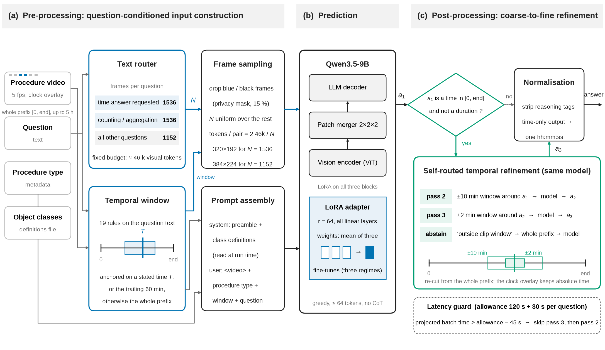
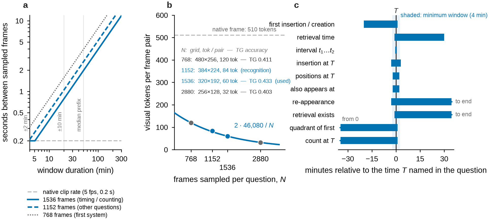
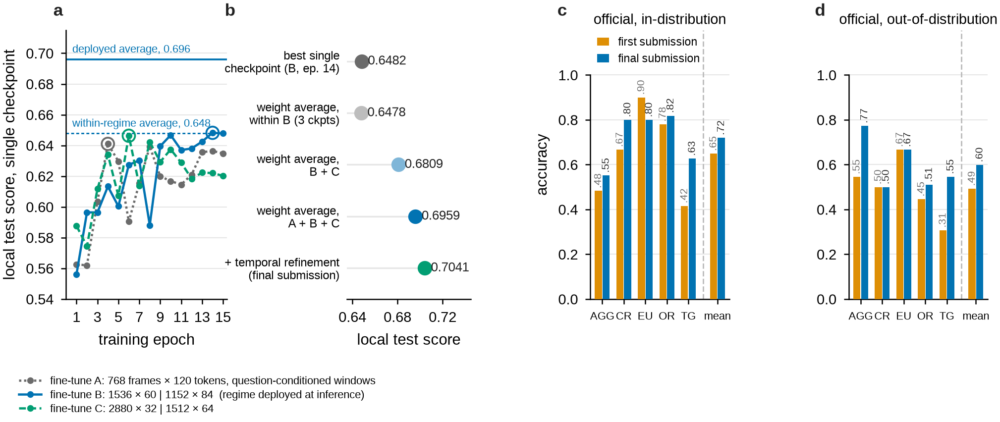
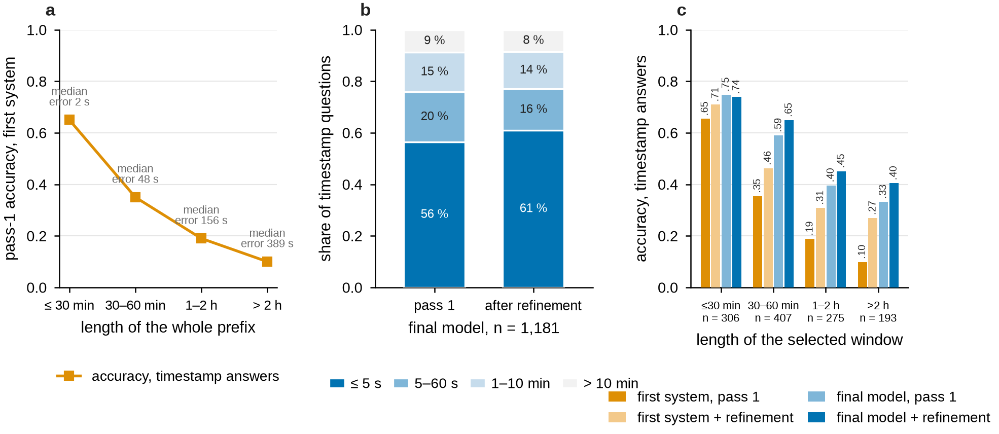
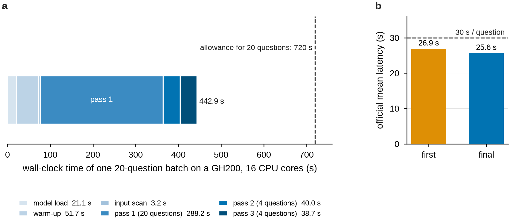

# Method

A recording has 10⁴–10⁵ frames; a question needs a few hundred. SurgScope picks them from the
question text, before and after one forward pass of a fine-tuned Qwen3.5-9B.

<p align="center"></p>

## Input construction

**Dead frames.** Privacy-masked (blue) and black frames — 15 % of all frames — are detected on
32×18 keyframe thumbnails (> 90 % blue or black pixels) and skipped.

**Temporal window** ([`routing.py`](../surgscope/routing.py)). The questions follow templates
with class-independent phrase signatures, matched in order:

- 11 anchored rules for questions that name a time T, e.g. "when is it retrieved" → [T − 1 min, T + 30 min];
- 8 "last occurrence" families → the last 60 minutes;
- everything else → the whole prefix [0, end].

Windows are at least 4 minutes long. Training uses the same windows; a time answer outside its
window becomes `outside clip window`, which at inference triggers a retry on the whole prefix.

**Frame budget** ([`policy.py`](../surgscope/policy.py)). Timestamp and counting questions get
1536 frames at 60 tokens per frame pair (320×192), all others 1152 frames at 84 tokens (384×224);
both cost ~46k visual tokens. Frames are sampled uniformly over the live frames of the window and
encoded at N / window-length fps with the grid baked in; exact times come from the burned-in clock.

<p align="center"></p>

**Prompt** ([`prompts.py`](../surgscope/prompts.py)). System: a fixed preamble plus the object
definitions read at run time from `FO_definitions.json`. User:

```
<video>Procedure type: {procedure_type}.
Clip window: {HH:MM:SS start} - {HH:MM:SS end} (source-video timeline).
{question}
```

Greedy decoding, ≤ 64 tokens, thinking disabled.

## Model

Qwen3.5-9B with LoRA (r = 64, α = 128) on all linear layers of the vision encoder, merger and
language model. Three fine-tunes with different sampling regimes (768 frames; 1536 / 1152;
2880 / 1512) are averaged into one model — LoRA A and B averaged separately, then merged.
Averaging across regimes gains 4.8 points over the best fine-tune; averaging checkpoints of one
fine-tune gains nothing.

<p align="center"></p>

## Coarse-to-fine refinement

If the answer is a time in [0, end] (and the question is not "how long"), the question is asked
again on ±10 min around it, then on ±2 min around the new answer, with the same frame count —
from one frame every 4.7 s on a two-hour window to every frame. A third answer without a time
is discarded. Timestamp-only answers are normalised to one HH:MM:SS.

<p align="center"></p>

## Latency

25.6 s per question on the challenge H100 (budget 30 s). `--challenge-budget` skips refinement
passes when the batch budget runs short.

<p align="center"></p>
